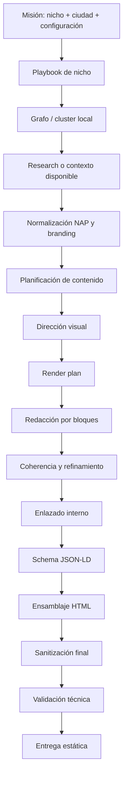

# Arquitectura de la Pipeline Gravity

## 1. Visión general

La pipeline Gravity organiza la generación de páginas en fases. Cada fase transforma o valida una parte del resultado final: contexto, estructura, contenido, diseño, enlaces, schema, HTML y entrega.

El sistema está pensado para evitar que toda la responsabilidad caiga en una sola llamada al LLM. En lugar de eso, reparte el trabajo entre módulos y agentes especializados.

## 2. Flujo general

## 3. Fases principales

### Fase 0: Entrada de misión

La misión define los datos mínimos:

- Nicho.
- Ciudad o área.
- Tipo de página.
- Perfil de generación.
- Datos de marca/NAP si existen.
- Configuración de salida.

La calidad de la misión influye mucho en la salida. Si falta teléfono, dirección o empresa real, Gravity debe degradar el contenido de forma honesta.

### Fase 1: Playbook de nicho

El playbook concentra reglas editoriales y semánticas por vertical. Su función es orientar al sistema sobre:

- Vocabulario correcto.
- Servicios típicos del sector.
- Intenciones de búsqueda.
- Riesgos de contaminación con otros nichos.
- Tono recomendado.

Ejemplo: una página de carpinteros debe hablar de madera, puertas, armarios, herrajes o montaje, no de tuberías ni diferenciales eléctricos.

### Fase 2: Site Graph / cluster local

El grafo permite organizar relaciones entre páginas. Puede representar:

- Página principal.
- Páginas por ciudad.
- Páginas por barrio.
- Páginas por servicio.
- Relaciones internas recomendadas.

Su uso principal es alimentar el enlazado interno y evitar páginas aisladas.

### Fase 3: Investigación o contexto

Gravity puede trabajar con contexto investigado o con contexto prefetched. La documentación debe evitar decir que siempre hay scraping SERP real, porque algunas ejecuciones usan información ya preparada o entradas internas.

El objetivo real es proporcionar señales útiles a los agentes:

- Ciudad.
- Nicho.
- Intenciones del usuario.
- Servicios relevantes.
- Términos locales si están disponibles.
- Competidores o referencias si el módulo está configurado.

### Fase 4: Normalización NAP y branding

Esta fase limpia datos de identidad local:

- Nombre comercial.
- Teléfono.
- Dirección.
- Área servida.
- Marca.
- CTA.

Regla clave: si un dato no existe o no está validado, no debe inventarse.

Ejemplos:

- Sin teléfono válido: usar `#contacto`, no `tel:` falso.
- Sin dirección validada: usar ciudad o área servida, no calle inventada.
- Sin reseñas reales: no generar `aggregateRating`.

### Fase 5: Planificación arquitectónica

El `ContentArchitectAgent` define la estructura de la página. Puede decidir secciones como:

- Hero.
- Servicios.
- Señales de confianza.
- Proceso de trabajo.
- Preguntas frecuentes.
- Enlaces internos.
- CTA final.

La salida debe tratarse como una estructura validable, no como texto libre sin contrato.

### Fase 6: Dirección visual

El `ArtDirectorAgent` define el ADN visual:

- Personalidad.
- Contraste.
- Familia visual.
- Tratamiento de tarjetas.
- Hero.
- Ritmo de secciones.

Tras el último hardening, esta fase debe operar en modo defensivo: si faltan secciones o variantes, debe usar valores por defecto y continuar.

### Fase 7: Render plan

El render plan traduce secciones lógicas a bloques visuales. Por ejemplo:

- `services` → grid de servicios.
- `faq` → acordeón.
- `trust` → panel de confianza.
- `cta` → bloque de contacto.

Este paso ayuda a separar contenido de presentación.

### Fase 8: Redacción por bloques

El contenido se genera por secciones, lo que facilita:

- Mejor control de calidad.
- Menos degradación del contexto.
- Revisión localizada.
- Sustitución de bloques concretos.

Cada bloque debe respetar el nicho, la ciudad y el nivel de veracidad de la misión.

### Fase 9: Coherencia, idioma y aislamiento de nicho

Esta fase revisa:

- Español natural de España.
- Preguntas con signos correctos.
- Frases locales completas.
- Ausencia de residuos de plantilla.
- No mezclar nichos.
- No afirmar datos no validados.

### Fase 10: Enlazado interno

El sistema crea enlaces internos entre páginas del cluster. La regla actual es mantenerlo limpio:

- Un único bloque principal de interlinking.
- No insertar enlaces después del footer.
- No duplicar títulos de navegación.
- No convertir el menú en FAQ.

### Fase 11: Schema JSON-LD

Gravity puede generar schema prudente:

- `WebSite`.
- `WebPage`.
- `BreadcrumbList`.
- `Service`.
- `LocalBusiness` solo con datos seguros.

No debe generar schema con reseñas, dirección o teléfono si esos datos no existen.

### Fase 12: Ensamblaje HTML

El `LayoutComposerAgent` une:

- Bloques de texto.
- Componentes visuales.
- CSS.
- Enlaces internos.
- Schema.
- Footer.

La salida principal confirmada es HTML estático.

### Fase 13: Sanitización final

Una de las capas más importantes. Debe limpiar:

- Textos internos.
- Placeholders.
- `undefined` o `null` visibles.
- FAQ contaminado.
- Bloques duplicados.
- Enlaces locales tipo `file:///`.
- Interlinking fuera de sitio.
- Fragmentos lingüísticos rotos.

### Fase 14: Validación técnica

Validaciones recomendadas:

- `lang="es-ES"`.
- `charset`.
- `viewport`.
- Canonical.
- Meta title y description.
- H1 único.
- Footer al final.
- JSON-LD parseable.
- Enlaces internos correctos.

### Fase 15: Entrega

La entrega confirmada es estática, normalmente en carpetas de salida como `output_sites`. WordPress y otros destinos deben tratarse como integraciones opcionales salvo que estén configurados y probados.

## 4. Principio técnico central

Cada fase debe poder fallar de forma controlada. Si falta un dato, la página debe degradarse con elegancia en lugar de romperse o inventar información.

Ese principio es clave para generar páginas premium de nichos locales sin comprometer la veracidad.
