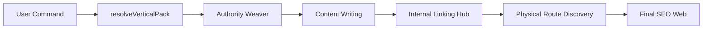

# Informe Técnico: El Knowledge Hub de Gravity (v6)

El **Knowledge Hub** es el sistema de inteligencia centralizada de Gravity que garantiza la autoridad tópica (Topical Authority), el cumplimiento de señales EEAT y la cohesión semántica en todos los sitios generados.

---

## 1. Arquitectura Conceptual
El Hub no es una base de datos única, sino una sinergia entre tres componentes:
1.  **Vertical Knowledge Packs**: Diccionarios de inteligencia por nicho.
2.  **Authority Weaver Agent**: El arquitecto que "teje" la confianza editorial.
3.  **Internal Linking Hub**: El motor que distribuye la autoridad mediante el descubrimiento físico de rutas.

---

## 2. El Core Semántico (Vertical Packs)
Ubicado en `src/knowledge-packs/`, este componente define qué puede y qué no puede decir el sistema para cada sector.

### Estructura de un Pack
Cada nicho hereda de una base (`VerticalPack`) y define sus propias restricciones:

```typescript
export interface VerticalPack {
    nicheMatchers: RegExp[];      // Identifica el nicho del comando del usuario
    allowedEntities: string[];    // Entidades LSI que deben aparecer
    forbiddenTerms: string[];     // "Stop words" para evitar sonar como IA robot
    technicalConcepts: string[];  // Jerga técnica real del sector
    trustSignals: string[];       // Señales de confianza específicas
}
```

### Ejemplo: Pack de Fontanería
El sistema utiliza estos datos para "inyectar" sabiduría en el `ContentWriterAgent`:

```typescript
fontaneria: pack({
    nicheMatchers: [/fontaner/i, /plomer/i, /tuber/i],
    allowedEntities: ['tuberías', 'PVC', 'cobre', 'multicapa', 'bajantes'],
    forbiddenTerms: ['soluciones prestadas', 'cronograma de servicios'],
    technicalConcepts: [
        'detección de fugas',
        'reparación de bajantes',
        'sustitución de sifones'
    ],
    trustSignals: ['materiales homologados', 'garantía de reparación']
})
```

---

## 3. Authority Weaver: El Tejedor de Confianza
El `AuthorityWeaverAgent` (`src/agents/weaver.ts`) es el encargado de transformar los datos crudos del Knowledge Pack en estrategias editoriales que Google valora (EEAT).

### Lógica de Ejecución
El agente selecciona dinámicamente "ángulos de soporte" según el tipo de página:

```typescript
const supportAngles = [
    `cómo elegir ${niche} sin improvisar en ${city}`,
    `casos habituales de ${niche} que se resuelven en ${city}`,
    pageType === 'guide'
    ? `errores frecuentes antes de contratar ${niche}`
    : `señales de confianza antes de contratar ${niche}`
];
```

Esto asegura que una guía de usuario no hable igual que una página de "Servicio Urgente", manteniendo la coherencia semántica.

---

## 4. Internal Linking Hub (Interconexionado)
Este es el componente más avanzado del Knowledge Hub (`src/internal-linking/autoBlocks.ts`). A diferencia de otros sistemas que "inventan" enlaces, Gravity realiza un **descubrimiento físico**.

### Descubrimiento de Rutas Reales
El sistema escanea el directorio `output_sites` para asegurar que el enlace que va a poner existe físicamente:

```typescript
function scanGeneratedRoutes(): GeneratedRoute[] {
    const root = outputRoot(); // /output_sites
    // ... escaneo recursivo buscando index.html
    return found; // Solo devuelve rutas que YA existen
}
```

### Inteligencia de Enlazado (Link Scoring)
Cuando el sistema decide enlazar, no lo hace al azar. Evalúa la "distancia semántica" y jerárquica:

```typescript
function scoreRouteMatch(route: GeneratedRoute, targetHref: string): number {
    let score = 0;
    if (route.publicHref === normalized) score += 50;   // Match exacto
    if (tail.join('/') === targetParts.join('/')) score += 40; // Estructura idéntica
    if (targetLast === tailLast) score += 12;            // Mismo servicio/ciudad
    return score;
}
```

### Ejemplo de Salida: Bloque de "Presencia Nacional"
El Hub genera automáticamente el HTML premium para estos enlaces, incluyendo mini-mapas o iconos si el diseño lo permite:

```html
<div class="internal-links-hub">
    <span class="block__eyebrow">Presencia Nacional</span>
    <h2 class="block__title">Expertos en otras ciudades</h2>
    <ul class="internal-links-grid">
        <!-- Generado dinámicamente por el Hub -->
    </ul>
</div>
```

---

## 5. Operación y Casos de Uso

El Knowledge Hub se activa automáticamente cuando se cumplen ciertas condiciones en la misión de generación. Aquí detallamos cómo controlarlo.

### 5.1. Activación por Misión (JSON)
Para que el sistema de interlinking y la inteligencia de nicho funcionen coordinadamente, la misión debe incluir la estructura de cluster:

```json
{
  "niche": "cerrajeria",
  "city": "Madrid",
  "cluster_folder_name": "cerrajeros-madrid",
  "cluster_data": {
    "geo": [
      { "name": "Barrio de las Letras", "type": "neighborhood" },
      { "name": "Chamberí", "type": "neighborhood" }
    ]
  }
}
```

### 5.2. Opciones de Configuración (Power User)
Existen parámetros que modifican el comportamiento del Hub:

| Opción | Descripción | Impacto |
| :--- | :--- | :--- |
| `subPath` | Define la profundidad del slug | Afecta al cálculo de rutas relativas del Hub. |
| `is_cluster` | Booleano | Activa la generación masiva de nodos hermanos en el `SiteGraph`. |
| `wordCountTarget` | Number | Ajusta la densidad de entidades LSI extraídas del Knowledge Pack. |

---

## 6. Personalización y Extensibilidad

### Cómo añadir un nuevo Nicho (Knowledge Pack)
Si deseas que Gravity soporte un nuevo sector (ej. "Jardinería"), debes realizar tres pasos en `src/knowledge-packs/base.ts`:

1.  **Definir el Pack**: Crea una constante con los términos y señales de confianza.
    ```typescript
    const GARDEN_PACK = pack({
        nicheMatchers: [/jardin/i, /poda/i],
        allowedEntities: ['césped artificial', 'poda de altura', 'riego'],
        technicalConcepts: ['xerojardinería', 'abonado orgánico'],
        trustSignals: ['jardineros colegiados', 'presupuesto sin compromiso']
    });
    ```
2.  **Registrar en PACKS**: Añade la constante al objeto `PACKS`.
3.  **Añadir Alias**: En `ALIAS_TO_PACK`, mapea los posibles nombres del nicho (ej. `jardinero: 'jardineria'`).

### Modificación de Reglas de Enlazado (`linkRules.ts`)
Puedes ajustar el peso (score) de los enlaces para priorizar ciertas páginas:
- **Priorizar Urgencias**: Sube el score en la regla `service_to_subservices` si el subtype es `urgent`.
- **Nodos Huérfanos**: El validador avisará si una página no recibe enlaces del Hub, permitiéndote ajustar los *Topological Weights* dinámicamente.

---

## 7. Flujo de Inteligencia


---
> **Doc Update 2026-04-20**: Añadidas secciones de Operación, Configuración y Extensibilidad por petición del usuario.
> **Conclusión**: El Knowledge Hub no solo ayuda a escribir mejor, sino que "cose" el sitio web de forma que Google lo perciba como una entidad de autoridad real, no como una colección de páginas aisladas.
